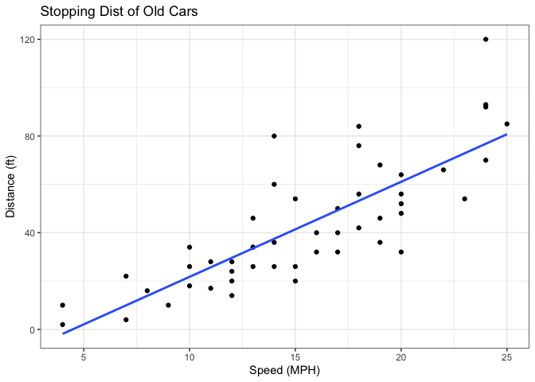
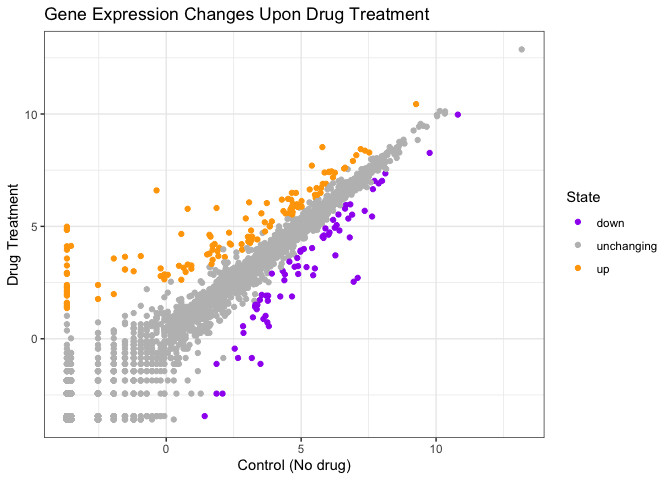
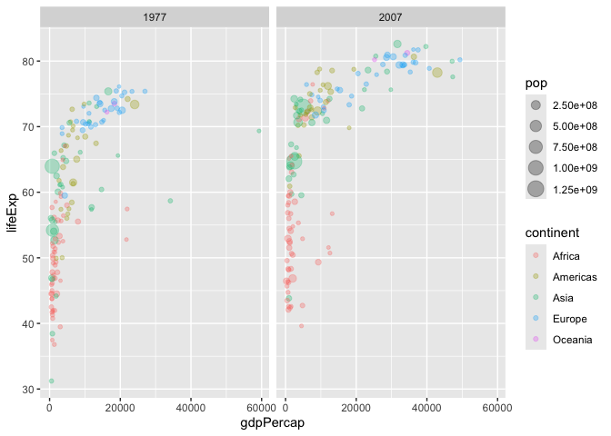
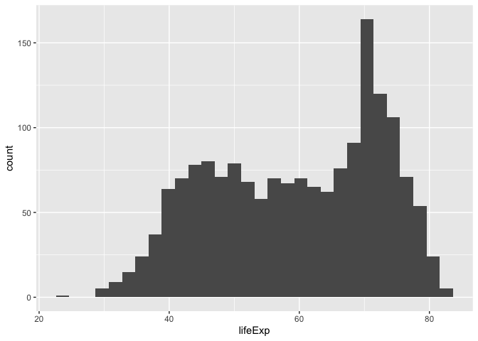
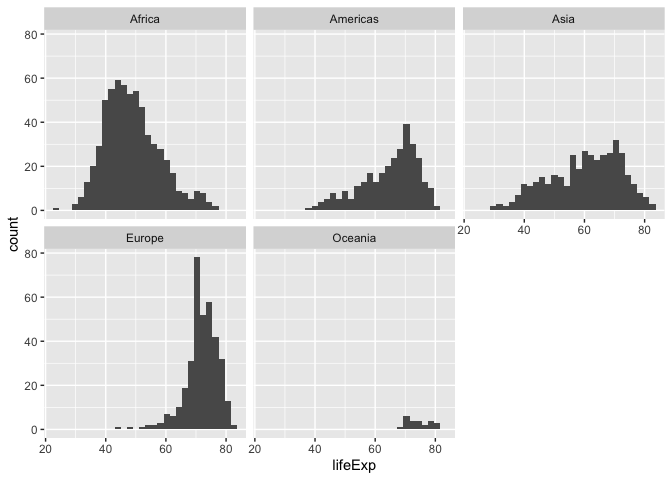

# Week5: Data Viz with ggplot2
Candice Lei (A18585167)

- [Background](#background)
- [Add some custom features](#add-some-custom-features)
- [Going Further](#going-further)

## Background

There are many graphic systems in R for making plots and figures. These
include so-called base R graphics like the `plot()` function and add on
packages like `ggplot2` Let’s compare how we make a simple figure with
these two systems: We can use the in-build ‘cars’ dataset:

``` r
head(cars)
```

      speed dist
    1     4    2
    2     4   10
    3     7    4
    4     7   22
    5     8   16
    6     9   10

``` r
plot(cars)
```


Before I can use ggplot2 I need to install it on my computer. To do
this, we can use the function ’install.packages(“ggplot2”) Once
installed we need to load up the package into our R brain:

``` r
library(ggplot2)
ggplot(cars)
```


Every ggplot has at least 3 layers:

``` r
ggplot(cars) +
  aes(x = speed, y = dist) +
  geom_point()
```


## Add some custom features

Let’s add a trend line that shows the relationship between speed and
distance

``` r
ggplot(cars) +
  aes(x = speed, y = dist) +
  geom_point() +
  geom_smooth()
```

    `geom_smooth()` using method = 'loess' and formula = 'y ~ x'


> Q. Can you make the `geom_smooth()` function produce a linear straight
> line to fit the data and turn off the “gray” error region?

``` r
ggplot(cars) +
  aes(x = speed, y = dist) +
  geom_point() +
  geom_smooth(method = "lm", se = FALSE) +
  theme_bw() +
  labs(title = "Stopping Dist of Old Cars",
       x = "Speed (MPH)",
       y = "Distance (ft)")
```

    `geom_smooth()` using formula = 'y ~ x'



``` r
url <- "https://bioboot.github.io/bimm143_S20/class-material/up_down_expression.txt"
genes <- read.delim(url)
head(genes)
```

            Gene Condition1 Condition2      State
    1      A4GNT -3.6808610 -3.4401355 unchanging
    2       AAAS  4.5479580  4.3864126 unchanging
    3      AASDH  3.7190695  3.4787276 unchanging
    4       AATF  5.0784720  5.0151916 unchanging
    5       AATK  0.4711421  0.5598642 unchanging
    6 AB015752.4 -3.6808610 -3.5921390 unchanging

``` r
nrow(genes)
```

    [1] 5196

``` r
colnames(genes)
```

    [1] "Gene"       "Condition1" "Condition2" "State"     

``` r
ncol(genes)
```

    [1] 4

``` r
sum(genes$State == "up")
```

    [1] 127

A useful new function in this context is the `table()` function:

``` r
table(genes$State)
```


          down unchanging         up 
            72       4997        127 

``` r
round(table(genes$State)/nrow(genes) * 100, 2)
```


          down unchanging         up 
          1.39      96.17       2.44 

My first plot attempt

``` r
ggplot(genes) +
  aes(x = Condition1, y = Condition2, col = State) +
  geom_point()
```


``` r
ggplot(genes) +
  aes(x = Condition1, y = Condition2, col = State) +
  geom_point() +
  scale_color_manual(values = c("purple", "gray", "orange")) +
  theme_bw() +
  labs(title = "Gene Expression Changes Upon Drug Treatment", x = "Control (No drug)", y = "Drug Treatment")
```



## Going Further

Here we read the famous gapminder dataset

``` r
# File location online
# File location online
url <- "https://raw.githubusercontent.com/jennybc/gapminder/master/inst/extdata/gapminder.tsv"

gapminder <- read.delim(url)
head(gapminder)
```

          country continent year lifeExp      pop gdpPercap
    1 Afghanistan      Asia 1952  28.801  8425333  779.4453
    2 Afghanistan      Asia 1957  30.332  9240934  820.8530
    3 Afghanistan      Asia 1962  31.997 10267083  853.1007
    4 Afghanistan      Asia 1967  34.020 11537966  836.1971
    5 Afghanistan      Asia 1972  36.088 13079460  739.9811
    6 Afghanistan      Asia 1977  38.438 14880372  786.1134

> Q. How many entries are in the dataset?

``` r
nrow(gapminder)
```

    [1] 1704

> Q. How many different “country” entries are in this dataset?

``` r
length(table(gapminder$country))
```

    [1] 142

``` r
length(unique(gapminder$country))
```

    [1] 142

Let’s make our first plot of the entire dataset: Plot of “gdpPercap” vs
“LifeExp” colored by “continent”

``` r
p <- ggplot(gapminder) +
  aes(gdpPercap, lifeExp, col = continent) +
  geom_point(alpha = 0.3)
```

I can add more layers to ‘p’

``` r
p +
  facet_wrap(~continent)
```


Make a plot for 1977 and 2007 only \> Q. First use the `dplyr` package
and the `filter()` function from that package to extract the year 2007.

``` r
library(dplyr)
```


    Attaching package: 'dplyr'

    The following objects are masked from 'package:stats':

        filter, lag

    The following objects are masked from 'package:base':

        intersect, setdiff, setequal, union

``` r
g07 <- filter(gapminder, year == 2007)
g77 <- filter(gapminder, year == 1977)
g <- filter(gapminder, year == 2007 | year == 1977)
```

``` r
ggplot(g) +
  aes(gdpPercap, lifeExp, col = continent, size = pop) +
  geom_point(alpha = 0.3) +
  facet_wrap(~year)
```



> Q. Make a histogram of lifeExp colored by continent Q. Make a
> histogram of lifeExp faceted by continent

``` r
ggplot(gapminder) +
  aes(lifeExp) +
  geom_histogram()
```

    `stat_bin()` using `bins = 30`. Pick better value `binwidth`.



``` r
ggplot(gapminder) +
  aes(lifeExp, fill = continent) +
  geom_histogram()
```

    `stat_bin()` using `bins = 30`. Pick better value `binwidth`.


``` r
ggplot(gapminder) +
  aes(lifeExp) +
  geom_histogram() +
  facet_wrap(~continent)
```

    `stat_bin()` using `bins = 30`. Pick better value `binwidth`.


