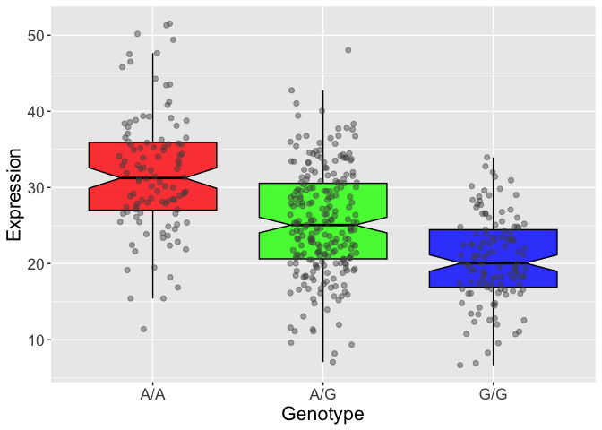

# Week12
Candice Lei (A18585167)
2026-05-11

- [Population Scale Analysis](#population-scale-analysis)

## Population Scale Analysis

> Q13. Read this file into R and determine the sample size for each
> genotype and their corresponding median expression levels for each of
> these genotypes.

``` r
url <- "https://bioboot.github.io/bggn213_W19/class-material/rs8067378_ENSG00000172057.6.txt"
expr_data <- read.table(url, header = TRUE)

head(expr_data)
```

       sample geno      exp
    1 HG00367  A/G 28.96038
    2 NA20768  A/G 20.24449
    3 HG00361  A/A 31.32628
    4 HG00135  A/A 34.11169
    5 NA18870  G/G 18.25141
    6 NA11993  A/A 32.89721

``` r
summary(expr_data)
```

        sample              geno                exp        
     Length:462         Length:462         Min.   : 6.675  
     Class :character   Class :character   1st Qu.:20.004  
     Mode  :character   Mode  :character   Median :25.116  
                                           Mean   :25.640  
                                           3rd Qu.:30.779  
                                           Max.   :51.518  

``` r
expr_data$geno <- factor(expr_data$geno, levels = c("A/A", "A/G", "G/G"))

table(expr_data$geno)
```


    A/A A/G G/G 
    108 233 121 

``` r
tapply(expr_data$exp, expr_data$geno, median)
```

         A/A      A/G      G/G 
    31.24847 25.06486 20.07363 

``` r
# Sample size per genotype
table(expr_data$geno)
```


    A/A A/G G/G 
    108 233 121 

``` r
# Median expression per genotype
tapply(expr_data$exp, expr_data$geno, median)
```

         A/A      A/G      G/G 
    31.24847 25.06486 20.07363 

> Q14. Generate a boxplot with a box per genotype, what could you infer
> from the relative expression value between A/A and G/G displayed in
> this plot? Does the SNP effect the expression of ORMDL3?

``` r
library(ggplot2)

ggplot(expr_data, aes(x = geno, y = exp, fill = geno)) +
  geom_boxplot(
    notch = TRUE,
    outlier.shape = NA,
    alpha = 0.8,
    color = "black"
  ) +
  geom_jitter(
    width = 0.2,
    alpha = 0.45,
    size = 1.8,
    color = "gray30"
  ) +
  scale_fill_manual(
    values = c("A/A" = "red", 
               "A/G" = "green", 
               "G/G" = "blue")
  ) +
  labs(
    x = "Genotype",
    y = "Expression"
  ) +
  theme_gray() +
  theme(
    legend.position = "none",
    axis.title = element_text(size = 16),
    axis.text = element_text(size = 13)
  )
```


