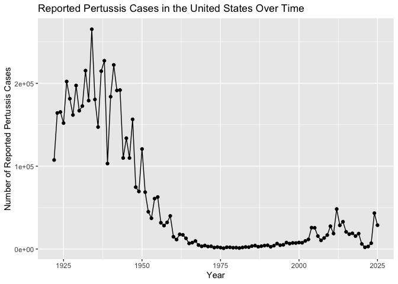
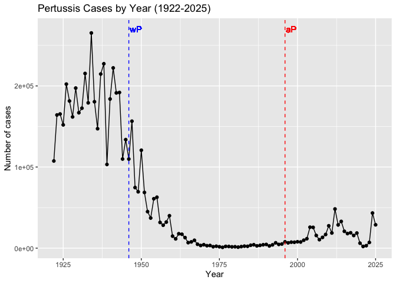
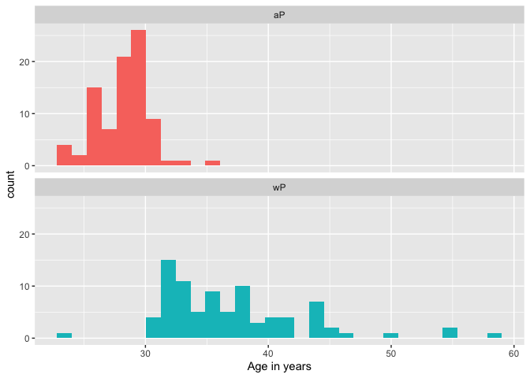
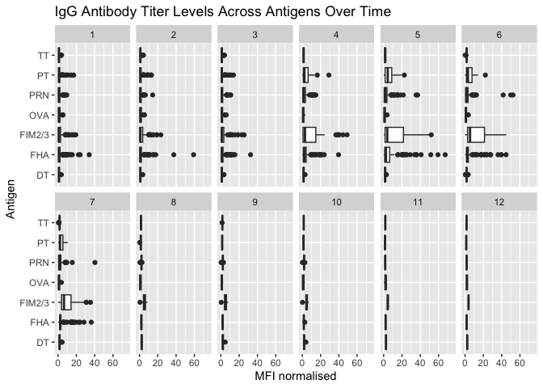
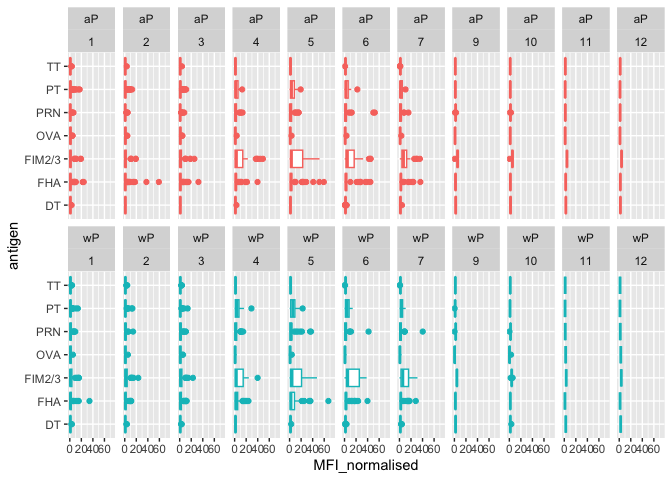
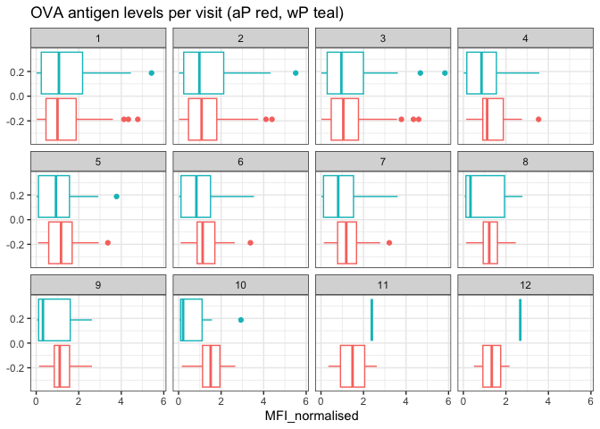
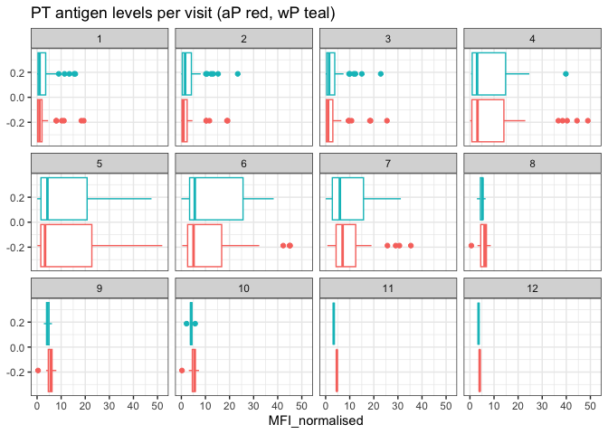
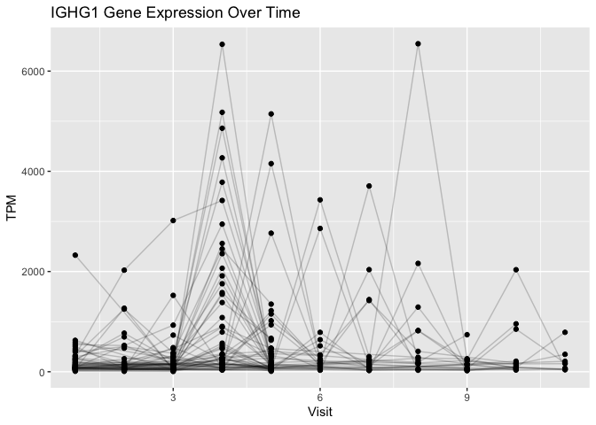

# Week18: Pertussis and the CMI-PB project
Candice Lei (A18585167)
2026-06-01

- [Investigating Pertussis Cases by
  Year](#investigating-pertussis-cases-by-year)
- [A Tale of Two Vaccines (wP & aP)](#a-tale-of-two-vaccines-wp--ap)
- [Exploring CMI-PB Data](#exploring-cmi-pb-data)
- [Examine IgG Ab Titer Levels](#examine-igg-ab-titer-levels)
- [Obtaining CMI-PB RNASeq Data](#obtaining-cmi-pb-rnaseq-data)

## Investigating Pertussis Cases by Year

> Q1. With the help of the R “addin”
> package [**datapasta**](https://milesmcbain.github.io/datapasta/) assign
> the CDC pertussis case number data to a data frame called `cdc` and
> use **ggplot** to make a plot of cases numbers over time.

``` r
library(ggplot2)
cdc <- read.csv("~/Downloads/U.S. Reported Pertussis Cases_ 1922 - 2025.csv")

names(cdc)
```

    [1] "Year"                               "Number.of.Reported.Pertussis.Cases"
    [3] "Data.Status"                       

``` r
cdc$Number.of.Reported.Pertussis.Cases <- as.numeric(
  gsub(",", "", cdc$Number.of.Reported.Pertussis.Cases)
)

ggplot(cdc) +
  aes(x = Year, y = Number.of.Reported.Pertussis.Cases) +
  geom_point() +
  geom_line() +
  labs(
    title = "Reported Pertussis Cases in the United States Over Time",
    x = "Year",
    y = "Number of Reported Pertussis Cases"
  )
```



## A Tale of Two Vaccines (wP & aP)

> **Q2.** Using the ggplot `geom_vline()` function add lines to your
> previous plot for the 1946 introduction of the wP vaccine and the 1996
> switch to aP vaccine (see example in the hint below). What do you
> notice?

I notice that after wP vaccine was introduced in 1946, the cases of
pertussis decreased. After the switch to the aP vaccine in 1996, the
amount of cases began to increase. This suggests that the aP vaccine may
not have provided immunity that lasts as long as the older wP vaccine.

``` r
ggplot(cdc) +
  aes(x = Year, y = Number.of.Reported.Pertussis.Cases) +
  geom_point() +
  geom_line() +
  geom_vline(xintercept = 1946, color = "blue", linetype = "dashed") +
  geom_vline(xintercept = 1996, color = "red", linetype = "dashed") +
  geom_text(
    aes(x = 1946, y = 270000, label = "wP"),
    color = "blue",
    hjust = -0.1
  ) +
  geom_text(
    aes(x = 1996, y = 270000, label = "aP"),
    color = "red",
    hjust = -0.1
  ) +
  labs(
    title = "Pertussis Cases by Year (1922-2025)",
    x = "Year",
    y = "Number of cases"
  )
```

    Warning in geom_text(aes(x = 1946, y = 270000, label = "wP"), color = "blue", : All aesthetics have length 1, but the data has 104 rows.
    ℹ Please consider using `annotate()` or provide this layer with data containing
      a single row.

    Warning in geom_text(aes(x = 1996, y = 270000, label = "aP"), color = "red", : All aesthetics have length 1, but the data has 104 rows.
    ℹ Please consider using `annotate()` or provide this layer with data containing
      a single row.



> Q3. Describe what happened after the introduction of the aP vaccine?
> Do you have a possible explanation for the observed trend?

After the introduction of the aP vaccine, pertussis cases began to
gradually increase in the U.S. This meant that the aP vaccine causes
fewer side effects, but doesn’t provide longer immunity. Other reasons
can include improved PCR testing and bacterial evolution that help *B.
pertussis* avoid vaccine induced immunity.

## Exploring CMI-PB Data

``` r
# Allows us to read, write and process JSON data
library(jsonlite)
subject <- read_json("https://www.cmi-pb.org/api/subject", simplifyVector = TRUE) 
head(subject, 3)
```

      subject_id infancy_vac biological_sex              ethnicity  race
    1          1          wP         Female Not Hispanic or Latino White
    2          2          wP         Female Not Hispanic or Latino White
    3          3          wP         Female                Unknown White
      year_of_birth date_of_boost      dataset
    1    1986-01-01    2016-09-12 2020_dataset
    2    1968-01-01    2019-01-28 2020_dataset
    3    1983-01-01    2016-10-10 2020_dataset

> Q4. How many aP and wP infancy vaccinated subjects are in the dataset?

There are 87 aP vaccinated subjects and 85 wP vaccinated subjects.

``` r
table(subject$infancy_vac)
```


    aP wP 
    87 85 

> Q5. How many Male and Female subjects/patients are in the dataset?

There are 112 female and 60 male patients in the dataset.

``` r
table(subject$biological_sex)
```


    Female   Male 
       112     60 

> Q6. What is the breakdown of race and biological sex (e.g. number of
> Asian females, White males etc…)?

``` r
table(subject$race, subject$biological_sex)
```

                                               
                                                Female Male
      American Indian/Alaska Native                  0    1
      Asian                                         32   12
      Black or African American                      2    3
      More Than One Race                            15    4
      Native Hawaiian or Other Pacific Islander      1    1
      Unknown or Not Reported                       14    7
      White                                         48   32

``` r
library(lubridate)
```


    Attaching package: 'lubridate'

    The following objects are masked from 'package:base':

        date, intersect, setdiff, union

``` r
today()
```

    [1] "2026-06-01"

``` r
today() - ymd("2000-01-01")
```

    Time difference of 9648 days

``` r
library(jsonlite)
library(lubridate)
library(dplyr)
```


    Attaching package: 'dplyr'

    The following objects are masked from 'package:stats':

        filter, lag

    The following objects are masked from 'package:base':

        intersect, setdiff, setequal, union

``` r
library(ggplot2)

subject$age <- today() - ymd(subject$year_of_birth)

ap <- subject %>% filter(infancy_vac == "aP")
wp <- subject %>% filter(infancy_vac == "wP")
```

> Q7. Using this approach determine (i) the average age of wP
> individuals, (ii) the average age of aP individuals; and (iii) are
> they significantly different?

The average age of wP individuals is 28 years. The average age of aP
individuals is 37 years. They are significantly different.

``` r
x <- t.test(
  time_length(wp$age, "years"),
  time_length(ap$age, "years")
)

x$p.value
```

    [1] 2.372101e-23

``` r
subject <- read_json(
  "https://www.cmi-pb.org/api/subject",
  simplifyVector = TRUE
)

subject$age <- today() - ymd(subject$year_of_birth)
```

``` r
library(dplyr)

ap <- subject %>% filter(infancy_vac == "aP")

round( summary( time_length( ap$age, "years" ) ) )
```

       Min. 1st Qu.  Median    Mean 3rd Qu.    Max. 
         23      27      28      28      29      35 

``` r
wp <- subject %>% filter(infancy_vac == "wP")

round(summary(time_length(wp$age, "years")))
```

       Min. 1st Qu.  Median    Mean 3rd Qu.    Max. 
         23      33      35      37      40      58 

> Q8. Determine the age of all individuals at time of boost?

``` r
int <- ymd(subject$date_of_boost) - ymd(subject$year_of_birth)
age_at_boost <- time_length(int, "year")
head(age_at_boost)
```

    [1] 30.69678 51.07461 33.77413 28.65982 25.65914 28.77481

> Q9. With the help of a faceted boxplot or histogram (see below), do
> you think these two groups are significantly different?

These two groups are significantly different. The histogram shows that
the aP group is mostly younger around mid-20s to early 30s. The wP group
is older and has a wider age range, going up to 60 years old. The t-test
gave a p-value of **2.37 × 10⁻²³** , which is smaller than 0.05. This
means that the difference in age between the aP and wP groups are
statistically significant. This is important because age can affect
immune responses, so age is a factor when you compare the two vaccines.

``` r
ggplot(subject) +
  aes(time_length(age, "year"),
      fill=as.factor(infancy_vac)) +
  geom_histogram(show.legend=FALSE) +
  facet_wrap(vars(infancy_vac), nrow=2) +
  xlab("Age in years")
```

    `stat_bin()` using `bins = 30`. Pick better value `binwidth`.



``` r
# Or use wilcox.test() 
x <- t.test(time_length( wp$age, "years" ),
       time_length( ap$age, "years" ))

x$p.value
```

    [1] 2.372101e-23

``` r
# Complete the API URLs...
library(jsonlite)
library(dplyr)

subject <- read_json(
  "https://www.cmi-pb.org/api/subject",
  simplifyVector = TRUE
)

specimen <- read_json(
  "https://www.cmi-pb.org/api/specimen",
  simplifyVector = TRUE
)

titer <- read_json(
  "https://www.cmi-pb.org/api/plasma_ab_titer",
  simplifyVector = TRUE
)
```

> Q9. Complete the code to join `specimen` and `subject` tables to make
> a new merged data frame containing all specimen records along with
> their associated subject details:

``` r
meta <- inner_join(specimen, subject)
```

    Joining with `by = join_by(subject_id)`

``` r
dim(meta)
```

    [1] 1503   13

``` r
head(meta)
```

      specimen_id subject_id actual_day_relative_to_boost
    1           1          1                           -3
    2           2          1                            1
    3           3          1                            3
    4           4          1                            7
    5           5          1                           11
    6           6          1                           32
      planned_day_relative_to_boost specimen_type visit infancy_vac biological_sex
    1                             0         Blood     1          wP         Female
    2                             1         Blood     2          wP         Female
    3                             3         Blood     3          wP         Female
    4                             7         Blood     4          wP         Female
    5                            14         Blood     5          wP         Female
    6                            30         Blood     6          wP         Female
                   ethnicity  race year_of_birth date_of_boost      dataset
    1 Not Hispanic or Latino White    1986-01-01    2016-09-12 2020_dataset
    2 Not Hispanic or Latino White    1986-01-01    2016-09-12 2020_dataset
    3 Not Hispanic or Latino White    1986-01-01    2016-09-12 2020_dataset
    4 Not Hispanic or Latino White    1986-01-01    2016-09-12 2020_dataset
    5 Not Hispanic or Latino White    1986-01-01    2016-09-12 2020_dataset
    6 Not Hispanic or Latino White    1986-01-01    2016-09-12 2020_dataset

> Q10. Now using the same procedure join `meta` with `titer` data so we
> can further analyze this data in terms of time of visit aP/wP,
> male/female

``` r
abdata <- inner_join(titer, meta)
```

    Joining with `by = join_by(specimen_id)`

``` r
dim(abdata)
```

    [1] 52576    20

> Q11. How many specimens (i.e. entries in `abdata`) do we have for
> each `isotype`?

The dataset contains 6,698 IgE entries, 3,240 IgG entries, and 7,968
entries each for IgG1, IgG2, IgG3, and IgG4.

``` r
table(abdata$isotype)
```


      IgE   IgG  IgG1  IgG2  IgG3  IgG4 
     6698  5389 10117 10124 10124 10124 

> Q12. What are the different `$dataset` values in `abdata` and what do
> you notice about the number of rows for the most “recent” dataset?

I used `table(abdata$dataset)` to count the number of rows from each
dataset. The dataset column shows that the data come from multiple
CMI-PB dataset releases. The most recent dataset has fewer rows compared
to the older datasets. This suggests that it may be incomplete or still
ongoing.

``` r
table(abdata$dataset)
```


    2020_dataset 2021_dataset 2022_dataset 2023_dataset 
           31520         8085         7301         5670 

``` r
unique(abdata$dataset)
```

    [1] "2020_dataset" "2021_dataset" "2022_dataset" "2023_dataset"

## Examine IgG Ab Titer Levels

``` r
igg <- abdata %>% filter(isotype == "IgG")
head(igg)
```

      specimen_id isotype is_antigen_specific antigen        MFI MFI_normalised
    1           1     IgG                TRUE      PT   68.56614       3.736992
    2           1     IgG                TRUE     PRN  332.12718       2.602350
    3           1     IgG                TRUE     FHA 1887.12263      34.050956
    4          19     IgG                TRUE      PT   20.11607       1.096366
    5          19     IgG                TRUE     PRN  976.67419       7.652635
    6          19     IgG                TRUE     FHA   60.76626       1.096457
       unit lower_limit_of_detection subject_id actual_day_relative_to_boost
    1 IU/ML                 0.530000          1                           -3
    2 IU/ML                 6.205949          1                           -3
    3 IU/ML                 4.679535          1                           -3
    4 IU/ML                 0.530000          3                           -3
    5 IU/ML                 6.205949          3                           -3
    6 IU/ML                 4.679535          3                           -3
      planned_day_relative_to_boost specimen_type visit infancy_vac biological_sex
    1                             0         Blood     1          wP         Female
    2                             0         Blood     1          wP         Female
    3                             0         Blood     1          wP         Female
    4                             0         Blood     1          wP         Female
    5                             0         Blood     1          wP         Female
    6                             0         Blood     1          wP         Female
                   ethnicity  race year_of_birth date_of_boost      dataset
    1 Not Hispanic or Latino White    1986-01-01    2016-09-12 2020_dataset
    2 Not Hispanic or Latino White    1986-01-01    2016-09-12 2020_dataset
    3 Not Hispanic or Latino White    1986-01-01    2016-09-12 2020_dataset
    4                Unknown White    1983-01-01    2016-10-10 2020_dataset
    5                Unknown White    1983-01-01    2016-10-10 2020_dataset
    6                Unknown White    1983-01-01    2016-10-10 2020_dataset

> Q13. Complete the following code to make a summary boxplot of Ab titer
> levels (MFI) for all antigens:

``` r
ggplot(igg) +
  aes(x = MFI_normalised, y = antigen) +
  geom_boxplot() +
  xlim(0, 75) +
  facet_wrap(vars(visit), nrow = 2) +
  labs(
    title = "IgG Antibody Titer Levels Across Antigens Over Time",
    x = "MFI normalised",
    y = "Antigen"
  )
```

    Warning: Removed 5 rows containing non-finite outside the scale range
    (`stat_boxplot()`).



> Q14. What antigens show differences in the level of IgG antibody
> titers recognizing them over time? Why these and not others?

The antigens that show the biggest changes over time are FHA, FIM2/3,
PRN, and PT. These are pertussis-related antigens, so the immune system
responds to them after the Tdap booster. Ova does not change much
because it is not part of the pertussis vaccine and acts more like a
control. DT and TT are for diphtheria and tetanus, so their patterns are
different from the pertussis antigens.

``` r
ggplot(igg) +
  aes(MFI_normalised, antigen, col=infancy_vac ) +
  geom_boxplot(show.legend = FALSE) + 
  facet_wrap(vars(visit), nrow=2) +
  xlim(0,75) +
  theme_bw()
```

    Warning: Removed 5 rows containing non-finite outside the scale range
    (`stat_boxplot()`).


``` r
igg %>% filter(visit != 8) %>%
ggplot() +
  aes(MFI_normalised, antigen, col=infancy_vac ) +
  geom_boxplot(show.legend = FALSE) + 
  xlim(0,75) +
  facet_wrap(vars(infancy_vac, visit), nrow=2)
```

    Warning: Removed 5 rows containing non-finite outside the scale range
    (`stat_boxplot()`).



> Q15. Filter to pull out only two specific antigens for analysis and
> create a boxplot for each. You can chose any you like. Below I picked
> a “control” antigen (**“OVA”**, that is not in our vaccines) and a
> clear antigen of interest (**“PT”**, Pertussis Toxin, one of the key
> virulence factors produced by the bacterium *B. pertussis*).

``` r
filter(igg, antigen == "OVA") %>%
  ggplot() +
  aes(MFI_normalised, col = infancy_vac) +
  geom_boxplot(show.legend = FALSE) +
  facet_wrap(vars(visit)) +
  theme_bw() +
  labs(title = "OVA antigen levels per visit (aP red, wP teal)"
    )
```



``` r
filter(igg, antigen == "FIM2/3") %>%
  ggplot() +
  aes(x = MFI_normalised, col = infancy_vac) +
  geom_boxplot(show.legend = FALSE) +
  facet_wrap(vars(visit)) +
  theme_bw() +
  labs(title = "PT antigen levels per visit (aP red, wP teal)")
```



> Q16. What do you notice about these two antigens time courses and the
> PT data in particular?

OVA stays low across all visits. This makes sense because it is not part
of the vaccine. FIM2/3 shows a stronger response and changes more over
time because it is a pertussis-related antigen. For PT, antibody levels
increase after the booster, peak around visit 5, and then start to
decline. PT levels are much higher than OVA.

> Q17. Do you see any clear difference in aP vs. wP responses?

I do not see a very clear difference between aP and wP responses. Both
groups show similar patterns over time.

``` r
abdata.21 <- abdata %>% filter(dataset == "2021_dataset")

abdata.21 %>% 
  filter(isotype == "IgG",  antigen == "PT") %>%
  ggplot() +
    aes(x=planned_day_relative_to_boost,
        y=MFI_normalised,
        col=infancy_vac,
        group=subject_id) +
    geom_point() +
    geom_line() +
    geom_vline(xintercept=0, linetype="dashed") +
    geom_vline(xintercept=14, linetype="dashed") +
  labs(title="2021 dataset IgG PT",
       subtitle = "Dashed lines indicate day 0 (pre-boost) and 14 (apparent peak levels)")
```


> Q18. Does this trend look similar for the 2020 dataset?

Yes, the 2020 dataset shows a similar trend. IgG levels against PT
increase after the booster, reach a peak around day 14, and then
decrease over time. This pattern is similar to the 2021 dataset. This
suggest that the PT antibody response rises shortly after boosting and
gradually declines.

## Obtaining CMI-PB RNASeq Data

``` r
url <- "https://www.cmi-pb.org/api/v2/rnaseq?versioned_ensembl_gene_id=eq.ENSG00000211896.7"

rna <- read_json(url, simplifyVector = TRUE) 
```

``` r
#meta <- inner_join(specimen, subject)
ssrna <- inner_join(rna, meta)
```

    Joining with `by = join_by(specimen_id)`

> Q19. Make a plot of the time course of gene expression for IGHG1 gene
> (i.e. a plot of `visit` vs. `tpm`).

``` r
ggplot(ssrna) +
  aes(x = visit, y = tpm, group = subject_id) +
  geom_point() +
  geom_line(alpha = 0.2) +
  labs(
    title = "IGHG1 Gene Expression Over Time",
    x = "Visit",
    y = "TPM"
  )
```



> Q20. What do you notice about the expression of this gene (i.e. when
> is it at it’s maximum level)?

IGHG1 expression is highest around visit 4. The expression starts low,
then strongly increases at visit 4, before decreasing again at later
visits.

> Q21. Does this pattern in time match the trend of antibody titer data?
> If not, why not?

The pattern does not match the antibody titer data. IGHG1 gene
expression peaks earlier, around visit 4, because this shows when cells
are actively producing antibody-related RNA. Antibody titers can stay
high longer because antibodies are proteins that remain in the blood
after the gene expression response decreases. RNA expression rises and
falls faster than antibody levels.

``` r
ggplot(ssrna) +
  aes(tpm, col=infancy_vac) +
  geom_boxplot() +
  facet_wrap(vars(visit))
```


``` r
ssrna %>%  
  filter(visit==4) %>% 
  ggplot() +
    aes(tpm, col=infancy_vac) + geom_density() + 
    geom_rug() 
```


