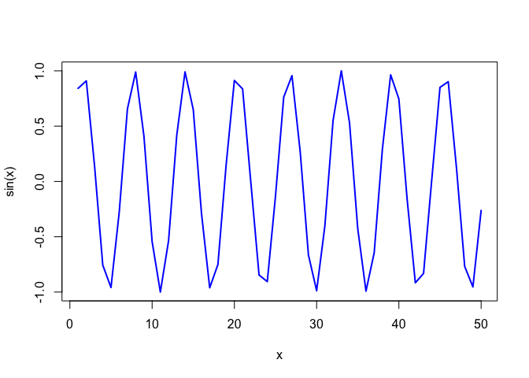

# Week4: Introduction to R
Candice Lei (A18585167)
2026-04-13

``` r
# A plot from week 3
x <- 1:50

plot(x, sin(x))
```


``` r
# make this a bit nicer
plot(x,sin(x), type="l", col = "blue", lwd = 2)
```


