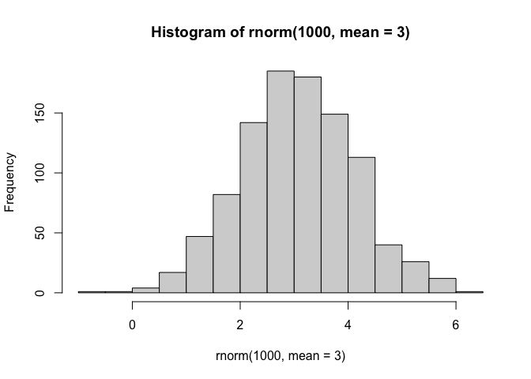
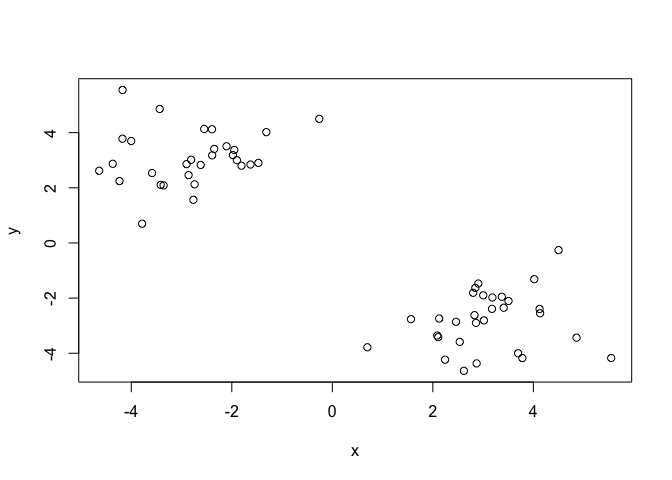
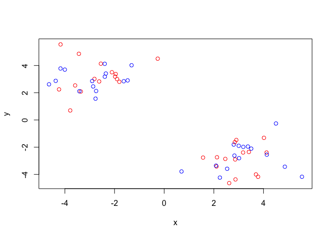
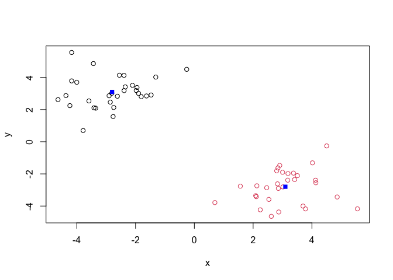
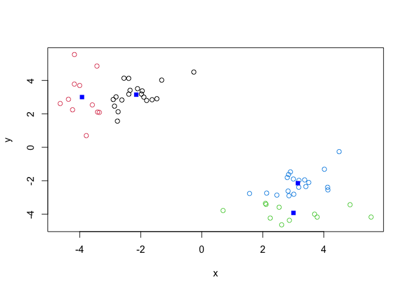
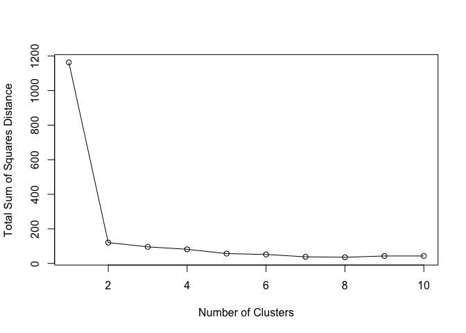
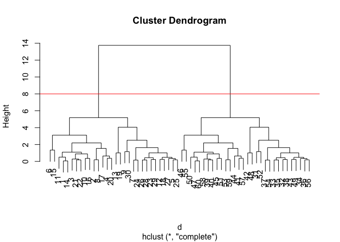
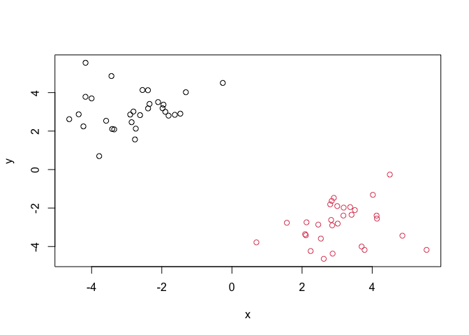
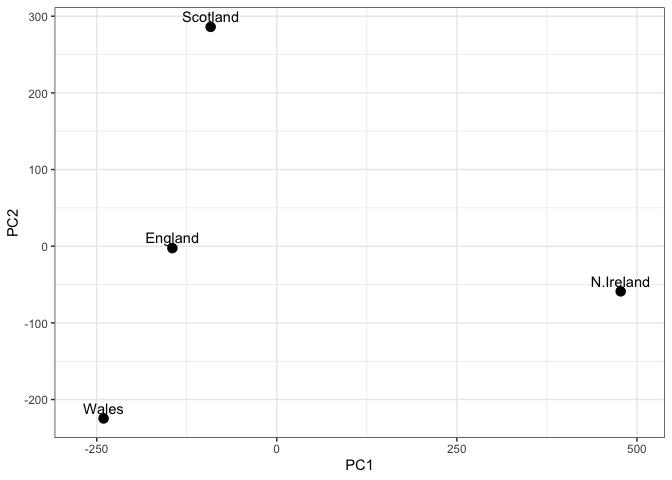
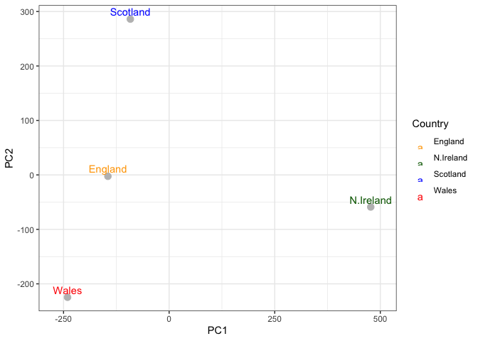

# Week 7 Lab: Machine Learning 1
Candice Lei (A18585167)
2026-04-21

- [Background](#background)
- [K-means clustering](#k-means-clustering)
- [Hierarchical Clustering](#hierarchical-clustering)
- [Principal Component Analysis
  (PCA)](#principal-component-analysis-pca)
- [Analysis of UK food data](#analysis-of-uk-food-data)
- [Data Import](#data-import)
- [Tidy data](#tidy-data)
- [Exporatory analysis](#exporatory-analysis)
- [PCA to the rescue](#pca-to-the-rescue)

## Background

Today we will explore some core machine learning methods that are very
popular in bioinformatics. These include **clustering** and
**dimensionality reduction**.

## K-means clustering

The main function in “base” R for K-means clustering is called
‘kmeans()’.

Before we go too deep let’s make up some “simple” data that we can
cluster and know if we are getting a good answer or not. To do this we
can use the ‘rnorm()’ function.

Let’s see what ‘rnorm()’ does.

``` r
hist( rnorm(1000, mean =3))
```



``` r
x <- c( rnorm(30, -3), rnorm(30, +3))
z <- cbind(x=x, y=rev(x))
plot(z)
```



``` r
#rev(x)
```

Now we can run ‘kmeans()’ on this input ‘z’ and see what the results
look like.

``` r
km <- kmeans(z, centers = 2)
km
```

    K-means clustering with 2 clusters of sizes 30, 30

    Cluster means:
              x         y
    1 -2.798650  3.096417
    2  3.096417 -2.798650

    Clustering vector:
     [1] 1 1 1 1 1 1 1 1 1 1 1 1 1 1 1 1 1 1 1 1 1 1 1 1 1 1 1 1 1 1 2 2 2 2 2 2 2 2
    [39] 2 2 2 2 2 2 2 2 2 2 2 2 2 2 2 2 2 2 2 2 2 2

    Within cluster sum of squares by cluster:
    [1] 60.2855 60.2855
     (between_SS / total_SS =  89.6 %)

    Available components:

    [1] "cluster"      "centers"      "totss"        "withinss"     "tot.withinss"
    [6] "betweenss"    "size"         "iter"         "ifault"      

``` r
attributes(km)
```

    $names
    [1] "cluster"      "centers"      "totss"        "withinss"     "tot.withinss"
    [6] "betweenss"    "size"         "iter"         "ifault"      

    $class
    [1] "kmeans"

> Q. How many points are in each cluster?

``` r
km$size
```

    [1] 30 30

> Q. What “component” of your result object details cluster
> assignment/membership?

``` r
km$cluster
```

     [1] 1 1 1 1 1 1 1 1 1 1 1 1 1 1 1 1 1 1 1 1 1 1 1 1 1 1 1 1 1 1 2 2 2 2 2 2 2 2
    [39] 2 2 2 2 2 2 2 2 2 2 2 2 2 2 2 2 2 2 2 2 2 2

> Q. What “component” of your result object details cluster center?

``` r
km$centers
```

              x         y
    1 -2.798650  3.096417
    2  3.096417 -2.798650

> Q. Plot ‘z’ colored by the kmeans cluster assignment and add cluster
> centers as blue prints.

``` r
plot(z, col=c("red", "blue"))
```



``` r
plot(z, col=km$cluster)
points(km$centers, col="blue", pch = 15)
```



> Q. Run a K-means clustering and plot the results asking for 4 clusters
> (K=4)?

``` r
km4 <- kmeans(z, centers = 4)
plot(z, col=km4$cluster)
points(km4$centers, col="blue", pch=15)
```



> **N.B** You need to tell K-means the number of clusters (i.e. set
> ‘centers =2’)!!

One approach is to try different values for ‘centers’ and then pick the
best…

``` r
ans <- NULL
for(i in 1:10) {
  km <- kmeans(z, centers = i)
  ans <- c(ans, km$tot.withinss)
}

plot(ans, typ = "o", xlab = "Number of Clusters",
     ylab = "Total Sum of Squares Distance")
```



## Hierarchical Clustering

The main function in “base” R for Hierarchical Clustering is called
‘hclust()’.

This function does not take your “raw” data for clustering. You must
first build a “distance matrix” from your data and pass this as input to
‘hclust()’.

``` r
d <- dist(z)
hc <- hclust(d)
hc
```


    Call:
    hclust(d = d)

    Cluster method   : complete 
    Distance         : euclidean 
    Number of objects: 60 

There is a bespoke `plot()` method for `hclust()` result objects.

``` r
plot(hc)
abline(h=8, col="red")
```



Once we have our `hclust` object (our “tree” of “cluster dendrogram”) we
can *“cut”* the tree to reveal the clustering pattern.

``` r
cutree(hc, k = 4)
```

     [1] 1 1 1 1 2 1 2 1 2 1 1 2 2 1 1 1 1 2 2 1 1 1 2 2 2 2 2 2 2 2 3 3 3 3 3 3 3 3
    [39] 4 4 4 3 3 4 4 4 4 3 3 4 4 3 4 3 4 3 4 4 4 4

> Q. Make a plot of `z` with your hclust results (i.e. colored by
> cluster membership).

``` r
grps <- cutree(hc, k=2)
plot(z, col=grps)
```



## Principal Component Analysis (PCA)

PCA is a dimensionallity reduction method that is popular for revealing
patterns in complex datasets.

## Analysis of UK food data

Let’s look at some data on the eating habits of folks from the UK to see
if there are patterns and trends that have some regions being distinct
from others.

## Data Import

The data is made available in CSV format so we can use the `read.csv()`
function for import to R:

``` r
url <- "https://tinyurl.com/UK-foods"
x <- read.csv(url, row.names = 1)
head(x)
```

                   England Wales Scotland N.Ireland
    Cheese             105   103      103        66
    Carcass_meat       245   227      242       267
    Other_meat         685   803      750       586
    Fish               147   160      122        93
    Fats_and_oils      193   235      184       209
    Sugars             156   175      147       139

> Q1. How many rows and columns are in your new data frame named x? What
> R functions could you use to answer this question?

17 rows and 4 columns.

``` r
# rows and columns
dim(x)
```

    [1] 17  4

``` r
# number of rows
nrow(x)
```

    [1] 17

``` r
# number of columns
ncol(x)
```

    [1] 4

> Q2. Which approach to solving the ‘row-names problem’ mentioned above
> do you prefer and why? Is one approach more robust than another under
> certain circumstances?

I prefer the `row.names = 1` way better because it is faster and it is
more robust than the other approach. The other approach `x <- x[,-1]` if
we run this multiple times, it will remove the first column repeatedly.

## Tidy data

Fix anything that went wrong with data import.

``` r
# Using base R
barplot(as.matrix(x), beside=T, col=rainbow(nrow(x)))
```


> Q3. Changing what optional argument in the above barplot() function
> results in the following plot?

Changing the optional argument `beside = FALSE` creates the stacked
barplot. If you left out that argument it is the same as setting it to
FALSE because the `barplot()` function uses FALSE on default.

``` r
# Change optional argument in beside = FALSE or leave it out
barplot(as.matrix(x), beside = FALSE, col = rainbow(nrow(x)))
```


``` r
# Convert data to long format for ggplot with `pivot_longer()`
library(tidyr)
x_long <- x |>
  tibble::rownames_to_column("Food") |>
  pivot_longer(cols = -Food,
               names_to = "Country",
               values_to = "Consumption")
dim(x_long)
```

    [1] 68  3

``` r
head(x_long)
```

    # A tibble: 6 × 3
      Food            Country   Consumption
      <chr>           <chr>           <int>
    1 "Cheese"        England           105
    2 "Cheese"        Wales             103
    3 "Cheese"        Scotland          103
    4 "Cheese"        N.Ireland          66
    5 "Carcass_meat " England           245
    6 "Carcass_meat " Wales             227

``` r
# Create grouped bar plot
library(ggplot2)
ggplot(x_long) +
  aes(x = Country, y = Consumption, fill = Food) +
  geom_col(position = "dodge") +
  theme_bw()
```


> Q4. Changing what optional argument in the above ggplot() code results
> in a stacked barplot figure?

``` r
# Change `geom_col()` to create stacked barplot
ggplot(x_long) +
  aes(x = Country, y = Consumption, fill = Food) +
  geom_col(position = "stack") +
  theme_bw()
```


## Exporatory analysis

Make some plots to help make sense of obvious trends…

> Q5. We can use the pairs() function to generate all pairwise plots for
> our countries. Can you make sense of the following code and resulting
> figure? What does it mean if a given point lies on the diagonal for a
> given plot?

The code creates a scatterplot comparing ever pair of country columns in
x. `x` = food consumption data, `col = rainbow(nrow(x))` = gives color
to each food category, `pch = 16` = uses solid circles for the points.
If a given point lies on the diagonal for a given plot, it means that
food category has the same consumption value in both countries being
compared.

``` r
pairs(x, col = rainbow(nrow(x)), pch = 16)
```


> Q6. Based on the pairs and heatmap figures, which countries cluster
> together and what does this suggest about their food consumption
> patterns? Can you easily tell what the main differences between N.
> Ireland and the other countries of the UK in terms of this data-set?

England and Wales cluster together suggesting their food consumption
patterns are the most similar. Based on the heatmap, N. Ireland looks to
be different in several food categories. However, it is not easy to tell
the main differences between N. Ireland and the other countries, as the
colors just show the overall patterns.

``` r
library(pheatmap)
pheatmap( as.matrix(x) )
```


> **Key-point**: Even relatively small datasets can prove challenging to
> interpret.

## PCA to the rescue

The main function in “base” R for PCA is called `prcomp()`. This
functions wants the “observations” to be rows and the “variables” to be
columns. So here we need to take the transpose of our `x` input object

``` r
# Use the `prcomp()` PCA function
pca <- prcomp( t(x) )
summary(pca)
```

    Importance of components:
                                PC1      PC2      PC3       PC4
    Standard deviation     324.1502 212.7478 73.87622 2.921e-14
    Proportion of Variance   0.6744   0.2905  0.03503 0.000e+00
    Cumulative Proportion    0.6744   0.9650  1.00000 1.000e+00

The returned `pca` object has components that we can use to make our
main result figures:

``` r
attributes(pca)
```

    $names
    [1] "sdev"     "rotation" "center"   "scale"    "x"       

    $class
    [1] "prcomp"

The main result figure from this analysis is called a “PC score plot” or
“ordenation plot” or “PC1 vs PC2 plot”.

> Q7. Complete the code below to generate a plot of PC1 vs PC2. The
> second line adds text labels over the data points.

``` r
# Create a data frame for plotting
df <- as.data.frame(pca$x)
df$Country <- rownames(df)

# Plot PC1 vs PC2 with ggplot
ggplot(pca$x) +
  aes(x = PC1, y = PC2, label = rownames(pca$x)) +
  geom_point(size = 3) +
  geom_text(vjust = -0.5) +
  xlim(-270, 500) +
  xlab("PC1") +
  ylab("PC2") +
  theme_bw()
```



> Q8. Customize your plot so that the colors of the country names match
> the colors in our UK and Ireland map and table at start of this
> document.

``` r
country_cols <- c(
  England = "orange",
  Wales = "red",
  Scotland = "blue",
  N.Ireland = "darkgreen"
)

ggplot(df) +
  aes(x = PC1, y = PC2, label = Country, color = Country) +
  geom_point(size = 3, color = "gray") +
  geom_text(vjust = -0.5) +
  scale_color_manual(values = country_cols) +
  xlim(-270, 500) +
  xlab("PC1") +
  ylab("PC2") +
  theme_bw()
```



``` r
# Use the square of `pca$sdev` to calculate how much variation in the original data each PC accounts for
v <- round(pca$sdev^2/sum(pca$sdev^2) * 100 )
v
```

    [1] 67 29  4  0

``` r
# or the second row here...
z <- summary(pca)
z$importance
```

                                 PC1       PC2      PC3          PC4
    Standard deviation     324.15019 212.74780 73.87622 2.921348e-14
    Proportion of Variance   0.67444   0.29052  0.03503 0.000000e+00
    Cumulative Proportion    0.67444   0.96497  1.00000 1.000000e+00

``` r
# Create scree plot with ggplot
variance_df <- data.frame(
  PC = factor(paste0("PC", 1:length(v)), levels = paste0("PC", 1:length(v))), 
  Variance = v
)

ggplot(variance_df) +
  aes(x = PC, y = Variance) +
  geom_col(fill = "steelblue") +
  xlab("Principal Component") +
  ylab("Percent Variation") +
  theme_bw() +
  theme(axis.text.x = element_text(angle = 0))
```


``` r
# Lets focus on PC1 as it accounts for > 90% of variance
ggplot(pca$rotation) +
  aes(x = PC1,
      y = reorder(rownames(pca$rotation), PC1)) +
  geom_col(fill = "steelblue") +
  xlab("PC1 Loading Score") +
  ylab("") +
  theme_bw() +
  theme(axis.text.y = element_text(size = 9))
```


> Q9: Generate a similar ‘loadings plot’ for PC2. What two food groups
> feature prominantely and what does PC2 maninly tell us about?

Soft drinks and fresh potatoes are the two food groups that feature
prominantely. PC2 mainly separates Scotland and Wales.

``` r
# Loadings plot for PC2
ggplot(pca$rotation) +
  aes(x = PC2, 
      y = reorder(rownames(pca$rotation), PC2)) +
  geom_col(fill = "steelblue") +
  xlab("PC2 Loading Score") +
  ylab("") +
  theme_bw() +
  theme(axis.text.y = element_text(size = 9))
```


