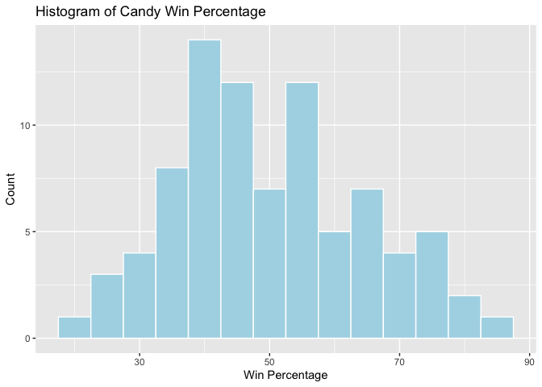
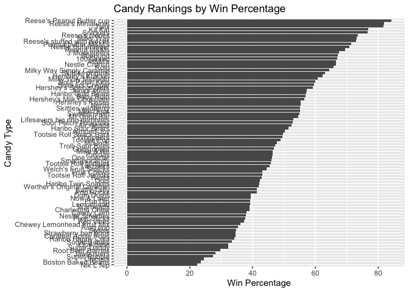
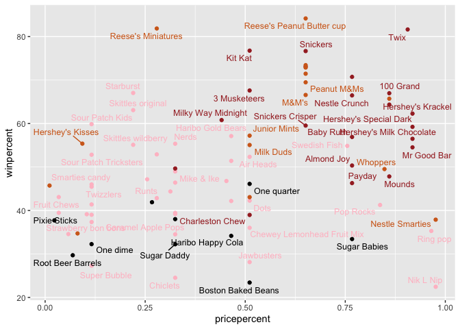
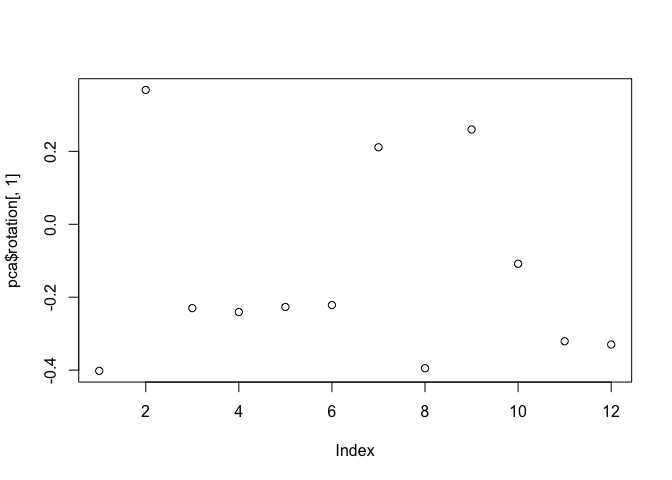
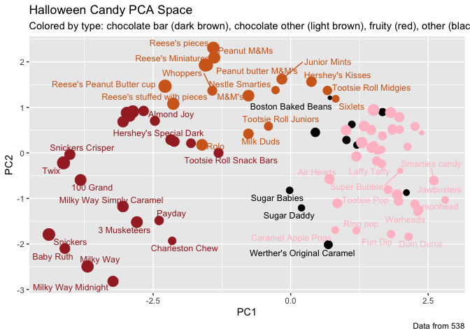
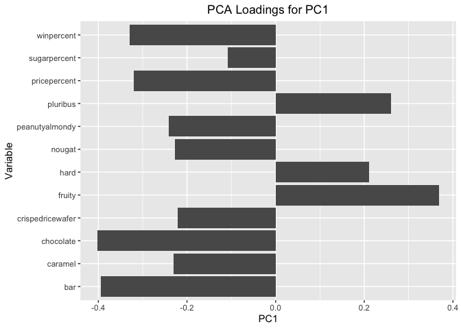

# Lab09: Candy Mini Project
Candice Lei (A18585167)
2026-04-30

- [Import Candy Data](#import-candy-data)
- [Exploratory Analysis](#exploratory-analysis)
- [Overall Candy Rankings](#overall-candy-rankings)
- [Time to add some useful color](#time-to-add-some-useful-color)
- [Taking a Look at PricePercent](#taking-a-look-at-pricepercent)
- [Exploring the Correlation
  Structure](#exploring-the-correlation-structure)
- [Principal Component Analysis
  (PCA)](#principal-component-analysis-pca)
- [Summary](#summary)

## Import Candy Data

``` r
candy_file <- "candy-data.csv"
candy <- read.csv(candy_file, row.names = 1)
head(candy)
```

                 chocolate fruity caramel peanutyalmondy nougat crispedricewafer
    100 Grand            1      0       1              0      0                1
    3 Musketeers         1      0       0              0      1                0
    One dime             0      0       0              0      0                0
    One quarter          0      0       0              0      0                0
    Air Heads            0      1       0              0      0                0
    Almond Joy           1      0       0              1      0                0
                 hard bar pluribus sugarpercent pricepercent winpercent
    100 Grand       0   1        0        0.732        0.860   66.97173
    3 Musketeers    0   1        0        0.604        0.511   67.60294
    One dime        0   0        0        0.011        0.116   32.26109
    One quarter     0   0        0        0.011        0.511   46.11650
    Air Heads       0   0        0        0.906        0.511   52.34146
    Almond Joy      0   1        0        0.465        0.767   50.34755

> Q1. How many different candy types are in this dataset?

There are 85 candy types.

``` r
# Counts how many rows there are
nrow(candy)
```

    [1] 85

> Q2. How many fruity candy types are in the dataset?

There are 38 fruity candy types.

``` r
# Counts how many candy have fruit = 1
sum(candy$fruity)
```

    [1] 38

``` r
candy["Twix", ]$winpercent
```

    [1] 81.64291

``` r
library(dplyr)
```


    Attaching package: 'dplyr'

    The following objects are masked from 'package:stats':

        filter, lag

    The following objects are masked from 'package:base':

        intersect, setdiff, setequal, union

``` r
candy |> 
  filter(row.names(candy)=="Twix") |>
  select(winpercent)
```

         winpercent
    Twix   81.64291

> Q3. What is your favorite candy (other than Twix) in the dataset and
> what is it’s winpercent value?

My favorite candy is Snickers and it’s winpercent value is 76.67378.

``` r
candy["Snickers", ]$winpercent
```

    [1] 76.67378

> Q4. What is the winpercent value for “Kit Kat”?

The winpercent value for “Kit Kat” is 76.7686.

``` r
candy["Kit Kat", ]$winpercent
```

    [1] 76.7686

> Q5. What is the winpercent value for “Tootsie Roll Snack Bars”?

The winpercent value for Tootsie Roll is 49.6535.

``` r
candy["Tootsie Roll Snack Bars", ]$winpercent
```

    [1] 49.6535

``` r
library("skimr")
skim(candy)
```

|                                                  |       |
|:-------------------------------------------------|:------|
| Name                                             | candy |
| Number of rows                                   | 85    |
| Number of columns                                | 12    |
| \_\_\_\_\_\_\_\_\_\_\_\_\_\_\_\_\_\_\_\_\_\_\_   |       |
| Column type frequency:                           |       |
| numeric                                          | 12    |
| \_\_\_\_\_\_\_\_\_\_\_\_\_\_\_\_\_\_\_\_\_\_\_\_ |       |
| Group variables                                  | None  |

Data summary

**Variable type: numeric**

| skim_variable | n_missing | complete_rate | mean | sd | p0 | p25 | p50 | p75 | p100 | hist |
|:---|---:|---:|---:|---:|---:|---:|---:|---:|---:|:---|
| chocolate | 0 | 1 | 0.44 | 0.50 | 0.00 | 0.00 | 0.00 | 1.00 | 1.00 | ▇▁▁▁▆ |
| fruity | 0 | 1 | 0.45 | 0.50 | 0.00 | 0.00 | 0.00 | 1.00 | 1.00 | ▇▁▁▁▆ |
| caramel | 0 | 1 | 0.16 | 0.37 | 0.00 | 0.00 | 0.00 | 0.00 | 1.00 | ▇▁▁▁▂ |
| peanutyalmondy | 0 | 1 | 0.16 | 0.37 | 0.00 | 0.00 | 0.00 | 0.00 | 1.00 | ▇▁▁▁▂ |
| nougat | 0 | 1 | 0.08 | 0.28 | 0.00 | 0.00 | 0.00 | 0.00 | 1.00 | ▇▁▁▁▁ |
| crispedricewafer | 0 | 1 | 0.08 | 0.28 | 0.00 | 0.00 | 0.00 | 0.00 | 1.00 | ▇▁▁▁▁ |
| hard | 0 | 1 | 0.18 | 0.38 | 0.00 | 0.00 | 0.00 | 0.00 | 1.00 | ▇▁▁▁▂ |
| bar | 0 | 1 | 0.25 | 0.43 | 0.00 | 0.00 | 0.00 | 0.00 | 1.00 | ▇▁▁▁▂ |
| pluribus | 0 | 1 | 0.52 | 0.50 | 0.00 | 0.00 | 1.00 | 1.00 | 1.00 | ▇▁▁▁▇ |
| sugarpercent | 0 | 1 | 0.48 | 0.28 | 0.01 | 0.22 | 0.47 | 0.73 | 0.99 | ▇▇▇▇▆ |
| pricepercent | 0 | 1 | 0.47 | 0.29 | 0.01 | 0.26 | 0.47 | 0.65 | 0.98 | ▇▇▇▇▆ |
| winpercent | 0 | 1 | 50.32 | 14.71 | 22.45 | 39.14 | 47.83 | 59.86 | 84.18 | ▃▇▆▅▂ |

> Q6. Is there any variable/column that looks to be on a different scale
> to the majority of the other columns in the dataset?

The winpercent column looks to be on a different scale compared to the
other columns. The majority of the other columns in the dataset have
values ranging from 0 to 1 and winpercent ranges from 20 to 85.

> Q7. What do you think a zero and one represent for the
> candy\$chocolate column?

A 0 represents the candy is not a chocolate and a 1 represents that the
candy is chocolate/has chocolate for the candy\$chocolate column.

## Exploratory Analysis

> Q8. Plot a histogram of winpercent values using both base R an
> ggplot2.

``` r
library(ggplot2)

ggplot(candy, aes(x = winpercent)) +
  geom_histogram(binwidth = 5, color = "white", fill = "lightblue") + 
  labs(title = "Histogram of Candy Win Percentage",
       x = "Win Percentage",
       y = "Count")
```



> Q9. Is the distribution of winpercent values symmetrical?

The distribution of winpercent values does not look perfectly
symmetrical.

> Q10. Is the center of the distribution above or below 50%?

Based on the `skim()` output, the median for p50 for winpercent is
47.83. The center of the distribution is below 50%.

> Q11. On average is chocolate candy higher or lower ranked than fruit
> candy?

``` r
mean(candy$winpercent[as.logical((candy$chocolate))])
```

    [1] 60.92153

``` r
mean(candy$winpercent[as.logical(candy$fruity)])
```

    [1] 44.11974

On average chocolate candy is ranked higher than fruit candy. This is
because chocolate candy have a higher mean winpercent, 60.92, compared
to the winpercent for fruit candy, 44.12.

> Q12. Is this difference statistically significant?

``` r
t.test(candy$winpercent[as.logical(candy$chocolate)], candy$winpercent[as.logical(candy$fruity)])
```


        Welch Two Sample t-test

    data:  candy$winpercent[as.logical(candy$chocolate)] and candy$winpercent[as.logical(candy$fruity)]
    t = 6.2582, df = 68.882, p-value = 2.871e-08
    alternative hypothesis: true difference in means is not equal to 0
    95 percent confidence interval:
     11.44563 22.15795
    sample estimates:
    mean of x mean of y 
     60.92153  44.11974 

The difference is statistically significant. The p-value is less than
0.05, which means chocolate candy have a significantly higher average
winpercent then fruit candy.

## Overall Candy Rankings

> Q13. What are the five least liked candy types in this set?

The least 5 liked candy types are Nik L Nip, Boston Baked Beans,
Chiclets, Super Bubble, and Jawbusters.

``` r
library(dplyr)

candy |>
  arrange(winpercent) |>
  head(5)
```

                       chocolate fruity caramel peanutyalmondy nougat
    Nik L Nip                  0      1       0              0      0
    Boston Baked Beans         0      0       0              1      0
    Chiclets                   0      1       0              0      0
    Super Bubble               0      1       0              0      0
    Jawbusters                 0      1       0              0      0
                       crispedricewafer hard bar pluribus sugarpercent pricepercent
    Nik L Nip                         0    0   0        1        0.197        0.976
    Boston Baked Beans                0    0   0        1        0.313        0.511
    Chiclets                          0    0   0        1        0.046        0.325
    Super Bubble                      0    0   0        0        0.162        0.116
    Jawbusters                        0    1   0        1        0.093        0.511
                       winpercent
    Nik L Nip            22.44534
    Boston Baked Beans   23.41782
    Chiclets             24.52499
    Super Bubble         27.30386
    Jawbusters           28.12744

> Q14. What are the top 5 all time favorite candy types out of this set?

``` r
candy |>
  arrange(desc(winpercent)) |>
  head(5)
```

                              chocolate fruity caramel peanutyalmondy nougat
    Reese's Peanut Butter cup         1      0       0              1      0
    Reese's Miniatures                1      0       0              1      0
    Twix                              1      0       1              0      0
    Kit Kat                           1      0       0              0      0
    Snickers                          1      0       1              1      1
                              crispedricewafer hard bar pluribus sugarpercent
    Reese's Peanut Butter cup                0    0   0        0        0.720
    Reese's Miniatures                       0    0   0        0        0.034
    Twix                                     1    0   1        0        0.546
    Kit Kat                                  1    0   1        0        0.313
    Snickers                                 0    0   1        0        0.546
                              pricepercent winpercent
    Reese's Peanut Butter cup        0.651   84.18029
    Reese's Miniatures               0.279   81.86626
    Twix                             0.906   81.64291
    Kit Kat                          0.511   76.76860
    Snickers                         0.651   76.67378

The top 5 favorite candy are Reese’s Peanut Butter Cup, Reese’s
Miniatures, Twix, Kit Kat, and Snickers.

> Q15. Make a first barplot of candy ranking based on winpercent values.

``` r
ggplot(candy) +
  aes(winpercent, rownames(candy)) +
  geom_col()
```


> Q16. This is quite ugly, use the reorder() function to get the bars
> sorted by winpercent?

``` r
ggplot(candy) +
  aes(x = winpercent, y = reorder(rownames(candy), winpercent)) +
  geom_col() +
  labs(title = "Candy Rankings by Win Percentage",
       x = "Win Percentage",
       y = "Candy Type")
```



## Time to add some useful color

``` r
my_cols=rep("black", nrow(candy))
my_cols[as.logical(candy$chocolate)] = "chocolate"
my_cols[as.logical(candy$bar)] = "brown"
my_cols[as.logical(candy$fruity)] = "pink"

ggplot(candy) + 
  aes(winpercent, reorder(rownames(candy),winpercent)) +
  geom_col(fill=my_cols) 
```


> Q17. What is the worst ranked chocolate candy?

The worst ranked chocolate candy is Boston Baked Beans.

> Q18. What is the best ranked fruity candy?

The best ranked fruity candy is Starburst.

## Taking a Look at PricePercent

``` r
library(ggrepel)

ggplot(candy) +
  aes(pricepercent, winpercent, label = rownames(candy)) +
  geom_point(col = my_cols) +
  geom_text_repel(col = my_cols, size = 3.3, max.overlaps = 5)
```



> Q19. Which candy type is the highest ranked in terms of winpercent for
> the least money - i.e. offers the most bang for your buck?

Reese’s Miniatures has a very high winpercent and a low pricepercent.

``` r
candy[order(candy$pricepercent, -candy$winpercent), c("pricepercent", "winpercent")]
```

                                pricepercent winpercent
    Tootsie Roll Midgies               0.011   45.73675
    Pixie Sticks                       0.023   37.72234
    Fruit Chews                        0.034   43.08892
    Dum Dums                           0.034   39.46056
    Strawberry bon bons                0.058   34.57899
    Root Beer Barrels                  0.069   29.70369
    Sixlets                            0.081   34.72200
    Hershey's Kisses                   0.093   55.37545
    Lemonhead                          0.104   39.14106
    Sour Patch Kids                    0.116   59.86400
    Sour Patch Tricksters              0.116   52.82595
    Smarties candy                     0.116   45.99583
    Twizzlers                          0.116   45.46628
    Laffy Taffy                        0.116   41.38956
    Warheads                           0.116   39.01190
    Red vines                          0.116   37.34852
    One dime                           0.116   32.26109
    Super Bubble                       0.116   27.30386
    Starburst                          0.220   67.03763
    Skittles original                  0.220   63.08514
    Skittles wildberry                 0.220   55.10370
    Trolli Sour Bites                  0.255   47.17323
    Werther's Original Caramel         0.267   41.90431
    Reese's Miniatures                 0.279   81.86626
    Lifesavers big ring gummies        0.279   52.91139
    Runts                              0.279   42.84914
    Welch's Fruit Snacks               0.313   44.37552
    Nerds                              0.325   55.35405
    Tootsie Roll Snack Bars            0.325   49.65350
    Tootsie Pop                        0.325   48.98265
    Mike & Ike                         0.325   46.41172
    Now & Later                        0.325   39.44680
    Fun Dip                            0.325   39.18550
    Candy Corn                         0.325   38.01096
    Caramel Apple Pops                 0.325   34.51768
    Sugar Daddy                        0.325   32.23100
    Chiclets                           0.325   24.52499
    Milky Way Midnight                 0.441   60.80070
    Gobstopper                         0.453   46.78335
    Haribo Gold Bears                  0.465   57.11974
    Haribo Sour Bears                  0.465   51.41243
    Haribo Twin Snakes                 0.465   42.17877
    Haribo Happy Cola                  0.465   34.15896
    Kit Kat                            0.511   76.76860
    3 Musketeers                       0.511   67.60294
    Junior Mints                       0.511   57.21925
    Milk Duds                          0.511   55.06407
    Air Heads                          0.511   52.34146
    One quarter                        0.511   46.11650
    Tootsie Roll Juniors               0.511   43.06890
    Dots                               0.511   42.27208
    Charleston Chew                    0.511   38.97504
    Chewey Lemonhead Fruit Mix         0.511   36.01763
    Jawbusters                         0.511   28.12744
    Boston Baked Beans                 0.511   23.41782
    Reese's Peanut Butter cup          0.651   84.18029
    Snickers                           0.651   76.67378
    Reese's pieces                     0.651   73.43499
    Milky Way                          0.651   73.09956
    Reese's stuffed with pieces        0.651   72.88790
    Peanut butter M&M's                0.651   71.46505
    Peanut M&Ms                        0.651   69.48379
    M&M's                              0.651   66.57458
    Snickers Crisper                   0.651   59.52925
    Swedish Fish                       0.755   54.86111
    Nestle Butterfinger                0.767   70.73564
    Nestle Crunch                      0.767   66.47068
    Baby Ruth                          0.767   56.91455
    Almond Joy                         0.767   50.34755
    Payday                             0.767   46.29660
    Sugar Babies                       0.767   33.43755
    Pop Rocks                          0.837   41.26551
    Whoppers                           0.848   49.52411
    100 Grand                          0.860   66.97173
    Rolo                               0.860   65.71629
    Milky Way Simply Caramel           0.860   64.35334
    Mounds                             0.860   47.82975
    Twix                               0.906   81.64291
    Hershey's Krackel                  0.918   62.28448
    Hershey's Special Dark             0.918   59.23612
    Hershey's Milk Chocolate           0.918   56.49050
    Mr Good Bar                        0.918   54.52645
    Ring pop                           0.965   35.29076
    Nestle Smarties                    0.976   37.88719
    Nik L Nip                          0.976   22.44534

> Q20. What are the top 5 most expensive candy types in the dataset and
> of these which is the least popular?

The top 5 most expensive candy are Nik L Nip, Nestle Smarties, Ring pop,
Hershey’s Krackel, Hershey’s Milk Chocolate. Of those candies, Nik L Nip
is the least popular, since it has the lowest winpercent.

``` r
ord <- order(candy$pricepercent, decreasing = TRUE)
head(candy[ord, c("pricepercent", "winpercent")], n = 5)
```

                             pricepercent winpercent
    Nik L Nip                       0.976   22.44534
    Nestle Smarties                 0.976   37.88719
    Ring pop                        0.965   35.29076
    Hershey's Krackel               0.918   62.28448
    Hershey's Milk Chocolate        0.918   56.49050

## Exploring the Correlation Structure

``` r
library(corrplot)
```

    corrplot 0.95 loaded

``` r
cij <- cor(candy)
corrplot(cij)
```


> Q22. Examining this plot what two variables are anti-correlated
> (i.e. have minus values)?

Chocolate and fruity are anti-correlated.

> Q23. Similarly, what two variables are most positively correlated?

Chocolate and bar are the most positively correlated.

## Principal Component Analysis (PCA)

``` r
pca <- prcomp(candy, scale = TRUE)
summary(pca)
```

    Importance of components:
                              PC1    PC2    PC3     PC4    PC5     PC6     PC7
    Standard deviation     2.0788 1.1378 1.1092 1.07533 0.9518 0.81923 0.81530
    Proportion of Variance 0.3601 0.1079 0.1025 0.09636 0.0755 0.05593 0.05539
    Cumulative Proportion  0.3601 0.4680 0.5705 0.66688 0.7424 0.79830 0.85369
                               PC8     PC9    PC10    PC11    PC12
    Standard deviation     0.74530 0.67824 0.62349 0.43974 0.39760
    Proportion of Variance 0.04629 0.03833 0.03239 0.01611 0.01317
    Cumulative Proportion  0.89998 0.93832 0.97071 0.98683 1.00000

``` r
plot(pca$rotation[, 1])
```



``` r
plot(pca$x[, 1:2], col = my_cols, pch = 16)
```


``` r
my_data <- cbind(candy, pca$x[, 1:3])
p <- ggplot(my_data) +
  aes(x = PC1, y = PC2,
      size = winpercent / 100,
      text = rownames(my_data),
      label = rownames(my_data)) +
  geom_point(col = my_cols)
p
```


``` r
library(ggrepel)
p + geom_text_repel(size = 3.3, col = my_cols, max.overlaps = 7) +
  theme(legend.position = "none") +
  labs(title = "Halloween Candy PCA Space",
       subtitle = "Colored by type: chocolate bar (dark brown), chocolate other (light brown), fruity (red), other (black)", 
       caption = "Data from 538")
```



> Q24. Complete the code to generate the loadings plot above. What
> original variables are picked up strongly by PC1 in the positive
> direction? Do these make sense to you? Where did you see this
> relationship highlighted previously?

The original variables that were picked up strongly by PC1 in the
positive direction are fruity, pluribus, and hard. These do make sense
to me because fruity candy most of the time don’t have chocolate and
they come in multiple pieces or harder candy. I saw this relationship
highlighted in the previous correlation plot where fruity candy was
negatively correlated with chocolate.

``` r
ggplot(pca$rotation) +
  aes(PC1, rownames(pca$rotation)) +
  geom_col() +
  labs(title = "PCA Loadings for PC1",
       x = "PC1",
       y = "Variable") +
  theme(plot.title = element_text(hjust=0.5))
```



## Summary

> Q25. Based on your exploratory analysis, correlation findings, and PCA
> results, what combination of characteristics appears to make a
> “winning” candy? How do these different analyses (visualization,
> correlation, PCA) support or complement each other in reaching this
> conclusion?

The combination of characteristics that make a “winning” candy appear to
be chocolate, in a bar form, and not fruity/hard. The chocolate candies
have a higher winpercent compared to fruity candies. The t-test also
showed the difference was statistically significant. The top ranked
candies were also chocolate candy, like Reese’s, KitKat, and Snickers
with filling. The plots were able to help us visualize the ranking of
candies and the comparison of winpercent to other variables, like
pricepercent. The correlation plot showed that chocolate/winpercent are
positively related and fruit/chocolate are negatively related. The PCA
separated the chocolate/bar candies from the fruity/pluribus/hard
candies along PC1. All of these different analyses support the
conclusion that chocolate candies with filling appear to make a
“winning” candy.
